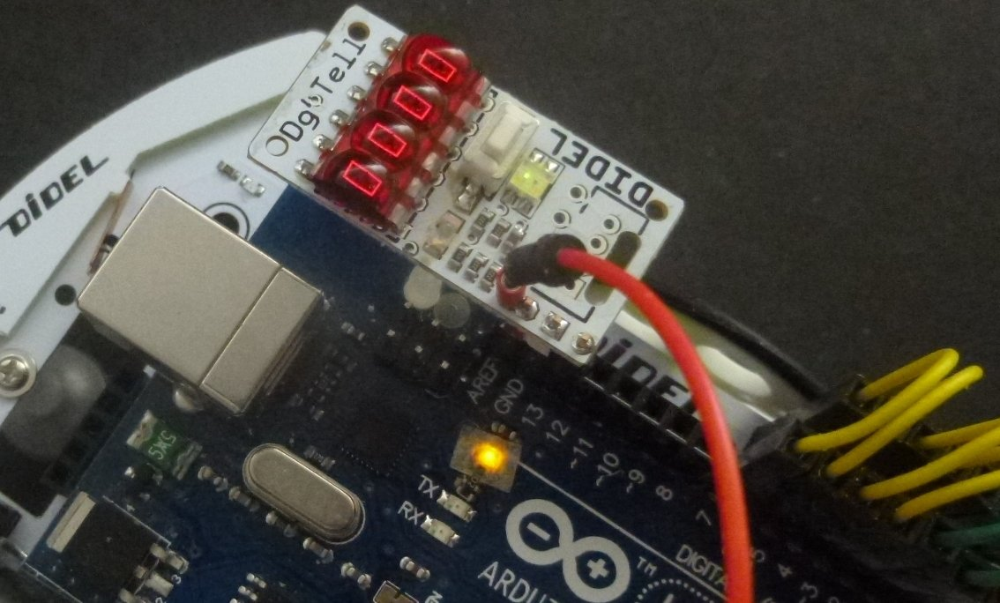

## DiTell debugging help
### Display 16 bits as hex or decimal numbers

Many 4-digit displays exist, controlled by 2 or 3 lines on special processor pins. **_DiTell_** or **_Tell_** is special in many ways
* It is controlled by a single output line, any free pin can be used.
* It calls a function of 120 bytes, portable C.
* The function runs on Arduino and with one parameter change on Tiny AVR with clock down to 1 MHz.  
* The blocking function transfer time is 3ms.
* The control with LibX interrupt takes 1 us evry 60 us and update the display every 20 ms.
* It is small and clean, easy to fit in any corner of your system. Usually on pin13, still available for blinking.
* connect with 3 wires, up to 50 cm long, or plug dirctly on your Arduino, using pin 13 you should have kept free for debugging.

Understanding and checking a sensor for a robot is usually done using Serial.print() on the Terminal, but this does not work any more when the robot is free. With  **_Tell_** you save 1 kbyte of code (and compile time), and need a single line of code to update the result. Select on the push button if binaly data is displayed in decimal or hex.

How does it works? Like the well known WS2801 PWM led, but with a relaxed timing, **_Tell_** decodes pulses of different width. On the board, a microcontroller decide from a push button how to display the data.
